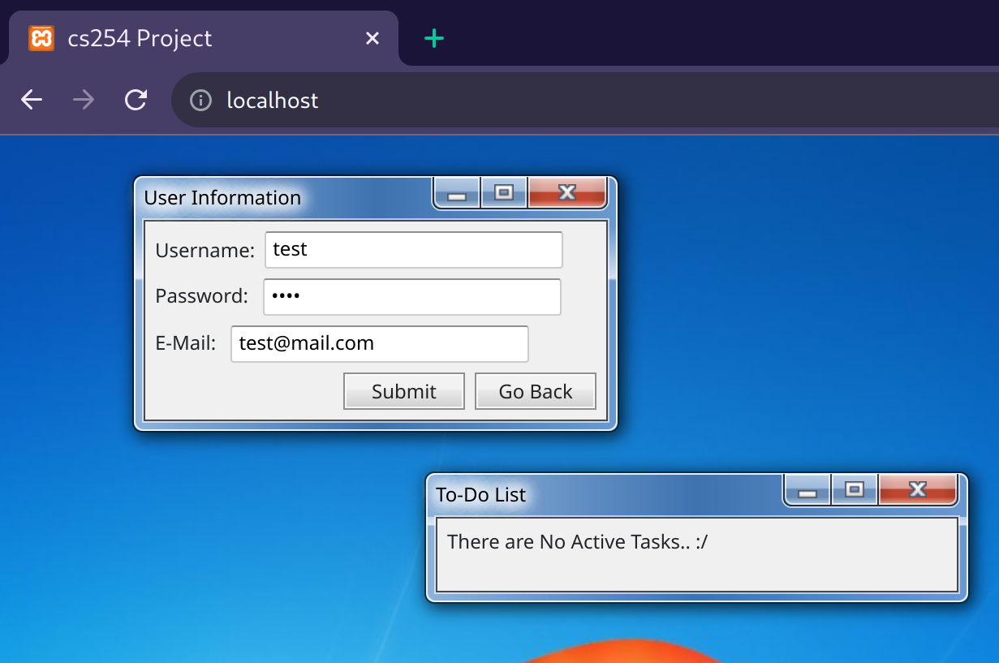
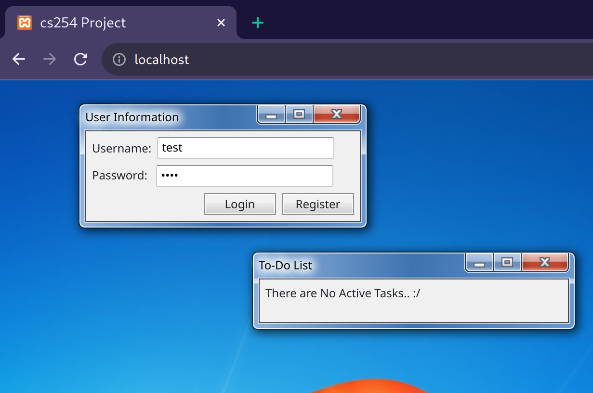
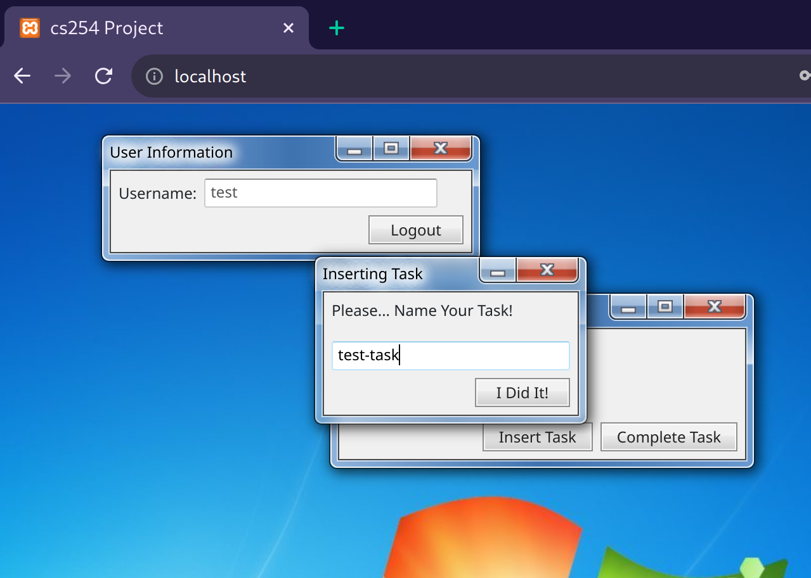
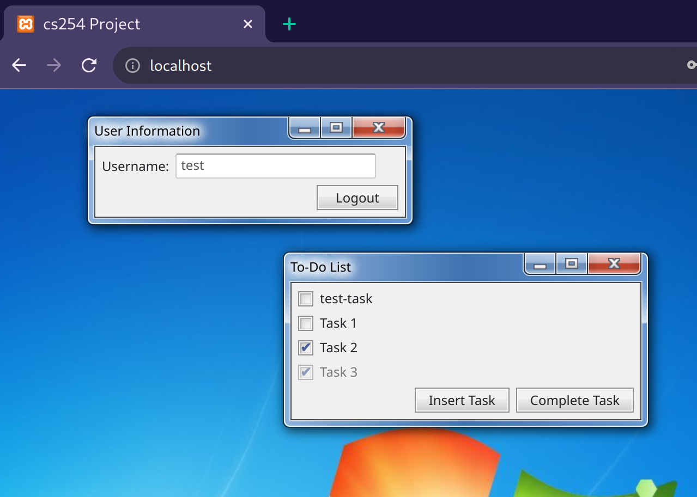

# CS 254-01 Final Project: To-Do-List 

## Group Members: 
- Sebastian Reyes | CWID: 886637420
- Amelia Rotondo  | CWID: 887925113
-----

## Table of Contents

- [Project Description](#project-description)
- [Installation](#installation)
- [Usage](#usage)
- [Configuration](#configuration)
- [License](#license)
- [Demo](#demo)

# project-description

 Our project is a _web-app_ that allows specific users to create a to-do-list to sort a given list of tasks. By hosting this application on the web multiple individual are able to contribute in doing tasks aswell as assigning task. With further development this could potential be utilized in a small office enviorment. Currently we have the website and database running on a local host, due to the cost of hosting this item online.

# installation

In order to install this web-app you must first download the files from our **github repository**.

After doing so you will need to install a few additionall tools to locally host the site and database. For our design and testing, we chose to work with Apache and MySQL. Please cite these tools to understand how to properly implement them. 

# configuration

The configuration for this _web-app_ is as follows. Utilizing _php & sql_ we are able to create a backend that saves individual user information. This information is used in order to identify specific  Task List . Additionally as mentioned in the **_installation_** section, there are specific tools that must be set up prior to use on a local machine:
- [Apache](https://httpd.apache.org/docs/)
- [MySQL](https://dev.mysql.com/doc/refman/8.0/en/)

# license

For styling we have used the **_7.css_** style sheet, which is protected under the **_MIT_** license. This helped us achive the older aesthetic. In addition, we used MySQL and Apache to locally host the database and webapp. Respectively, they are protected under the GPL2 and Apache licensing. 

# demo

Below you will find a few screen shots, giving examples of what the user should expect to see. 

The screenshot above displays how you would create an account as a user.
Additionally the task list will display in that manner if no task are found for the specific user.

The screenshot above displays no task for the specificed user.

Here the user is creating a task that will be populated into the task list.
We have added 3 tasks before hand.

In this screenshot we can see that task window has been updated and displays the users new task. 